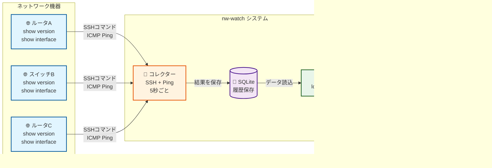

<!--
Copyright 2026 icecake0141
SPDX-License-Identifier: Apache-2.0

Licensed under the Apache License, Version 2.0 (the "License");
you may not use this file except in compliance with the License.
You may obtain a copy of the License at

    http://www.apache.org/licenses/LICENSE-2.0

This file was created or modified with the assistance of an AI (Large Language Model).
Review required for correctness, security, and licensing.
-->
# nw-watch - ネットワークデバイス CLI モニター

Python製のネットワーク監視システムです。複数のネットワーク機器へSSHで接続し、コマンド出力とpingデータを収集し、包括的な差分表示に対応したリアルタイムWebインターフェースで確認できます。

> English: [README.md](README.md) | Web UI スクリーンショット: [docs/webui-screenshots.ja.md](docs/webui-screenshots.ja.md)

## 概要



**nw-watchの機能:**
1. 🔄 **収集** - ネットワーク機器にSSH接続してCLIコマンドを実行し、Pingで接続性を監視
2. 💾 **保存** - コマンド出力とPing結果をローカルデータベースに履歴として保存
3. 📊 **表示** - Webインターフェースでリアルタイムデータを表示し、時系列やデバイス間の差分を比較

## 特徴

### データ収集
- **複数デバイスのSSH収集**: Netmikoを使用して複数のネットワーク機器へ同時にSSH接続
- **永続的SSH接続**: デバイスごとに長期間有効なSSH接続を維持し、認証オーバーヘッドを削減
  - 設定可能な接続永続化（デフォルトで有効）
  - 接続障害時の指数バックオフによる自動再接続
  - デバイスごとのロックによるスレッドセーフなコマンド実行
  - シャットダウン時の適切な接続クリーンアップ
- **柔軟なコマンドスケジューリング**: リソース使用を最適化するコマンド単位のcronスケジューリング
  - 異なる間隔で異なるコマンドを実行（例: バージョンチェックは6時間ごと、インターフェース状態は5分ごと）
  - 後方互換性 - スケジュールのないコマンドはグローバルインターバルを使用
- **並列実行**: ThreadPoolExecutorを使用してデバイス間でコマンドを並列実行
- **継続的なping監視**: 設定可能なping間隔（デフォルト: 1秒）でデバイスの到達性を追跡
- **コマンド履歴**: 設定可能な実行履歴の保持（デフォルト: デバイス/コマンドごとに10件）
- **堅牢なエラー処理**: 接続失敗やコマンドエラーを詳細なログと共に適切に処理

### 出力処理
- **スマートな行フィルタリング**: コマンド出力から特定の文字列を含む行を削除
  - グローバルフィルターは全コマンドに適用
  - コマンド単位のフィルターオーバーライドで細かい制御が可能
- **出力除外パターン**: エラーパターン（"% Invalid"、"% Ambiguous"など）を含む出力を自動的にマークして非表示
- **出力トリミング**: 設定可能な行数で出力の長さを制限してデータベースの肥大化を防止
- **メタデータ追跡**: 各実行の元の行数、トリミング状態、フィルター状態を記録

### Webインターフェース
- **リアルタイム更新**: FastAPI製のWebアプリケーションで設定可能な自動更新間隔
- **デバイス接続ダッシュボード**: 60秒の接続履歴を表示するビジュアルなpingタイムライン
  - カラーコード付きタイル（緑: 成功、赤: 失敗、灰: データなし）
  - 成功率とサンプル数
  - 平均RTT（往復時間）表示
  - 最終チェックのタイムスタンプ
- **コマンドタブ**: コマンドごとにグループ化された出力のビュー
  - 設定による並べ替え可能なタブ
  - デバイス別の出力履歴（新しい順）
  - タイムスタンプ、実行時間、ステータスを表示する展開可能な実行エントリ
  - 成功/エラー、フィルター済み、トリミング済みの状態を示すビジュアルバッジ
- **包括的な差分ビュー**:
  - **履歴差分**: 同一デバイスの前回 vs 最新の出力を比較
  - **デバイス間差分**: 同一コマンドの異なるデバイス間の出力を比較
  - カラーコード付きの変更を含むHTMLベースの並列比較
- **自動更新制御**: 手動更新オプション付きで自動更新の一時停止/再開が可能
- **JSTタイムゾーン表示**: すべてのタイムスタンプを日本標準時（UTC+9）で表示

## クイックスタート

### オプション1: Docker（推奨）

nw-watchを実行する最も簡単な方法は、DockerとDocker Composeを使用することです。

#### 前提条件

- Docker Engine 20.10以上
- Docker Compose 2.0以上

#### 手順

1. **リポジトリをクローン**

```bash
git clone https://github.com/icecake0141/nw-watch.git
cd nw-watch
```

2. **設定ファイルを作成**

```bash
cp config.example.yaml config.yaml
```

`config.yaml` をデバイス情報で編集します（下記の設定セクションを参照）。

3. **環境変数を設定**

```bash
cp .env.example .env
```

`.env` を編集してデバイスのパスワードを追加します:

```bash
DEVICEA_PASSWORD=your_password_here
DEVICEB_PASSWORD=your_password_here
```

4. **サービスを起動**

```bash
docker-compose up -d
```

これにより:
- Dockerイメージをビルド
- コレクターサービスを起動
- Webアプリケーションサービスを起動
- サービス間の共有ネットワークを作成
- Web UIのコレクター制御用に `./control` ディレクトリを作成

5. **Webインターフェースにアクセス**

ブラウザで以下のURLにアクセスします:

```
http://localhost:8000
```

6. **ログを表示**

```bash
# すべてのログを表示
docker-compose logs -f

# コレクターのログのみ表示
docker-compose logs -f collector

# Webアプリのログのみ表示
docker-compose logs -f webapp
```

7. **サービスを停止**

```bash
docker-compose down
```

### オプション2: ローカルインストール

Dockerを使用せずにnw-watchをローカルで実行する場合:

### 1. 依存関係をインストール

```bash
pip install -e ".[dev]"
```

### 2. デバイス設定

例の設定ファイルをコピーし、デバイス情報を編集します:

```bash
cp config.example.yaml config.yaml
```

`config.yaml` を編集し（パスワードは環境変数で指定）、監視対象の機器を追加します:

```bash
export DEVICEA_PASSWORD="password123"
export DEVICEB_PASSWORD="password123"
```

```yaml
interval_seconds: 5
ping_interval_seconds: 1
ping_window_seconds: 60
history_size: 10
max_output_lines: 500

global_filters:
  line_exclude_substrings:
    - "Temperature"
  output_exclude_substrings:
    - "% Invalid"

commands:
  - name: "show_version"
    command_text: "show version"
    filters:
      line_exclude_substrings:
        - "uptime"
  - name: "interfaces_status"
    command_text: "show interfaces status"
  - name: "ip_int_brief"
    command_text: "show ip interface brief"

devices:
  - name: "DeviceA"
    host: "192.168.1.1"
    port: 22
    username: "admin"
    password_env_key: "DEVICEA_PASSWORD"
    device_type: "cisco_ios"  # netmiko のデバイスタイプ
    ping_host: "192.168.1.1"

  - name: "DeviceB"
    host: "192.168.1.2"
    port: 22
    username: "admin"
    password_env_key: "DEVICEB_PASSWORD"
    device_type: "cisco_ios"
    ping_host: "192.168.1.2"
```

### 3. コレクターを起動

コレクターがデバイスへ接続してデータを収集します:

```bash
python -m collector.main --config config.yaml
```

コレクターの動作:
- 設定されたコマンドを5秒（設定可能）間隔で実行
- 各デバイスに1秒間隔でping
- SQLiteデータベース（`data/current.sqlite3`）に保存
- デバイス／コマンドごとに最新10件を保持

### 4. Webアプリを起動

別ターミナルでWebサーバーを起動します:

```bash
uvicorn webapp.main:app --reload --host 127.0.0.1 --port 8000
```

### 5. Web UIへアクセス

ブラウザで以下にアクセスします:

```
http://127.0.0.1:8000
```

## プロジェクト構成

```
nw-watch/
├── collector/          # データ収集モジュール
│   ├── __init__.py
│   └── main.py        # コレクターのメインロジック
├── webapp/            # Webアプリケーションモジュール
│   ├── __init__.py
│   ├── main.py        # FastAPIアプリ
│   ├── templates/     # Jinja2テンプレート
│   │   └── index.html
│   └── static/        # 静的ファイル
│       ├── style.css
│       └── app.js
├── shared/            # 共有ユーティリティ
│   ├── __init__.py
│   ├── config.py      # 設定ローダー
│   ├── db.py          # DB操作
│   ├── diff.py        # 差分生成
│   └── filters.py     # 出力フィルタリング・トリミング
├── tests/             # テストスイート
│   ├── __init__.py
│   ├── test_diff.py
│   ├── test_filters.py
│   ├── test_truncate.py
│   ├── test_db.py
│   ├── test_docker.py
│   └── test_webapp.py
├── control/           # コレクター制御状態（実行時に生成）
├── data/              # DB保存先（実行時に生成）
│   └── .gitkeep
├── Dockerfile         # Dockerイメージ定義
├── docker-compose.yml # Docker Composeオーケストレーション
├── .dockerignore      # Dockerビルド除外設定
├── .env.example       # 環境変数テンプレート
├── config.example.yaml
├── pyproject.toml
└── README.md
```

## 設定

### 基本設定

- `interval_seconds`: コマンド実行間隔（秒）
- `ping_interval_seconds`: ping実行間隔（秒）
- `ping_window_seconds`: pingタイムラインのウィンドウ秒数
- `history_size`: デバイス／コマンドごとに保持する履歴件数
- `max_output_lines`: フィルタ後に保持する最大行数（超過分はトリミング）

### WebSocket設定（オプション）

ポーリングの代わりにWebSocketでリアルタイム更新を有効にします:

```yaml
websocket:
  enabled: true           # WebSocketサポートを有効化（デフォルト: false）
  ping_interval: 20       # WebSocket pingインターバル（秒）（オプション、デフォルト: 20）
```

**WebSocketモードのメリット:**
- 新しいデータが到着したときの即座の更新（ポーリング遅延なし）
- サーバー負荷とネットワークトラフィックの削減
- リアルタイム更新によるより良いユーザーエクスペリエンス
- WebSocketが失敗した場合の自動的なポーリングへのフォールバック

**注意:** `enabled: false`（デフォルト）の場合、アプリケーションは後方互換性のために従来のHTTPポーリングを使用します。

### SSH接続設定（オプション）

永続的SSH接続の動作を設定します:

```yaml
ssh:
  persistent_connections: true   # 永続的SSH接続を使用（デフォルト: true）
  connection_timeout: 100        # SSH接続タイムアウト（秒）（デフォルト: 100）
  max_reconnect_attempts: 3      # 最大再接続試行回数（デフォルト: 3）
  reconnect_backoff_base: 1.0    # 指数バックオフの基本時間（秒）（デフォルト: 1.0）
```

**永続的接続のメリット:**
- **認証オーバーヘッドの削減**: SSH接続を一度確立し、複数のコマンドで再利用
- **リソース使用量の低減**: 繰り返しのTCPハンドシェイクとSSHネゴシエーションを排除
- **レート制限の回避**: 頻繁な接続試行によるデバイスのレート制限トリガーを防止
- **パフォーマンスの向上**: 接続セットアップ遅延なしで高速なコマンド実行

**接続管理:**
- 各デバイスは、すべてのコマンドで再利用される永続的SSH接続を1つ維持
- 接続が古くなったり失敗したりした場合は自動的に再接続
- スレッドセーフな実行により、一度に1つのコマンドのみが接続で実行されることを保証
- 指数バックオフにより、接続問題時のデバイスへの過負荷を防止
- コレクター停止時にすべての接続を適切にクローズ

**レガシーモード:** `persistent_connections: false`に設定すると、各コマンド実行ごとに新しい接続を作成する従来の動作を使用します（本番環境での使用は推奨されません）。

### デバイス

- `name`, `host`, `port`, `device_type`, `ping_host`
- `username`
- `password_env_key`: **SSHパスワードを格納する環境変数名**

### コマンド

コマンドは一度定義すると各デバイスで実行されます。各コマンドはオプションのフィルター、タブ順序の`sort_order`、および柔軟な実行タイミングのためのオプションの`schedule`をサポートします。

- `command_text`: CLIコマンド
- `schedule`: オプションのcron式（例: `"0 */6 * * *"`で6時間ごと、`"*/5 * * * *"`で5分ごと）
  - 指定された場合、コマンドはcronスケジュールに従って実行されます
  - 省略された場合、コマンドはグローバルの`interval_seconds`を使用します
  - 最適化されたリソース使用のために、異なるコマンドを異なる頻度で実行できます
- `filters.line_exclude_substrings`: グローバルな行フィルターを上書き
- `filters.output_exclude_substrings`: マッチした場合に出力を「フィルタ済み／非表示」として扱う

### コマンドスケジューリング

システムはcron式を使用したコマンド単位のスケジューリングをサポートし、異なるコマンドを異なる間隔で実行できます:

```yaml
commands:
  - name: "show_version"
    command_text: "show version"
    schedule: "0 */6 * * *"  # 6時間ごと
  - name: "interfaces_status"
    command_text: "show interfaces status"
    schedule: "*/5 * * * *"  # 5分ごと
  - name: "ip_int_brief"
    command_text: "show ip interface brief"
    # スケジュールなし - interval_secondsを使用
```

**メリット:**
- 最適化されたリソース使用 - コストの高いコマンドの実行頻度を下げる
- デバイス負荷の軽減 - コマンド実行を時間的に分散
- 柔軟な監視戦略 - コマンドごとに異なる更新頻度
- 有料API呼び出しやレート制限されたデバイスのコスト最適化

**Cron式フォーマット:**
```
* * * * *
│ │ │ │ │
│ │ │ │ └─── 曜日（0-6、日曜日=0）
│ │ │ └───── 月（1-12）
│ │ └─────── 日（1-31）
│ └───────── 時（0-23）
└─────────── 分（0-59）
```

**例:**
- `"*/5 * * * *"` - 5分ごと
- `"0 * * * *"` - 毎時0分
- `"0 */6 * * *"` - 6時間ごと
- `"0 0 * * *"` - 1日1回、深夜0時
- `"0 9-17 * * 1-5"` - 月曜日から金曜日の午前9時から午後5時まで、毎時の開始時

### フィルター

- `global_filters.line_exclude_substrings`: マッチする行を出力から除外
- `global_filters.output_exclude_substrings`: マッチした場合に「フィルタ済み」としてマーク（UIで非表示）
- コマンド単位のフィルターがグローバル設定を上書きします。

## データベーススキーマ

効率的なクエリとアトミックな更新のために設計された以下のSQLiteスキーマを使用します:

### テーブル

**devices**
- `id`: 主キー（自動インクリメント）
- `name`: 一意のデバイス名

**commands**
- `id`: 主キー（自動インクリメント）
- `command_text`: 一意のコマンドテキスト

**runs** - コマンド実行履歴
- `id`: 主キー（自動インクリメント）
- `device_id`: devicesテーブルへの外部キー
- `command_id`: commandsテーブルへの外部キー
- `ts_epoch`: UTCエポック秒でのタイムスタンプ
- `output_text`: 処理済みのコマンド出力（フィルタリング/トリミング後）
- `ok`: 成功フラグ（成功時1、失敗時0）
- `error_message`: 失敗時のエラー詳細
- `duration_ms`: 実行時間（ミリ秒）
- `is_filtered`: 出力が除外パターンに一致したことを示すフラグ
- `is_truncated`: 出力がトリミングされたことを示すフラグ
- `original_line_count`: フィルタリング/トリミング前の行数

**ping_samples** - ping監視データ
- `id`: 主キー（自動インクリメント）
- `device_id`: devicesテーブルへの外部キー
- `ts_epoch`: UTCエポック秒でのタイムスタンプ
- `ok`: 成功フラグ（成功時1、失敗時0）
- `rtt_ms`: ラウンドトリップ時間（ミリ秒、失敗時はnull）
- `error_message`: 失敗時のエラー詳細

### インデックス
- `idx_runs_device_command`: 高速な実行クエリのための(device_id, command_id)の複合インデックス
- `idx_runs_ts`: 時間ベースのクエリのためのts_epochのインデックス
- `idx_ping_device_ts`: pingタイムラインクエリのための(device_id, ts_epoch)の複合インデックス

## Web UI機能

### デバイス接続パネル
- 60秒のリアルタイムpingタイムライン（左が過去、右が最新）
- 成功率とサンプル数
- 平均RTT

### コマンドタブ
- コマンドごとに1タブ
- デバイス別の出力履歴（新しい順）
- メタデータ付きの展開表示

### 差分ビュー
- **前回 vs 最新**: 同一デバイスの連続実行結果を比較
- **デバイスA vs デバイスB**: デバイス間で出力を比較
- 行レベル差分を色付け表示（緑／赤）

### 自動更新制御
- 自動更新の一時停止／再開ボタン（停止中は画面にバナー表示）
- 一時停止中も手動更新ボタンで即時リロード可能
- ポーリング間隔は `interval_seconds` と `ping_interval_seconds` から算出

### コレクター制御
- バックエンドのコマンド実行を一時停止／再開（pingは継続）
- Web UIからコレクター停止を要求可能
- 制御情報は共有ファイル `./control/collector_control.json` に保存
- Dockerで `restart: unless-stopped` を使っている場合、停止要求後に自動再起動されるため、停止を維持したい場合は一時停止の利用やrestartポリシーの変更を検討してください。

### エクスポート機能
- **個別出力エクスポート**: オフライン分析のために単一のコマンド出力をエクスポート
  - テキスト形式: メタデータ付きの人間が読める形式（タイムスタンプ、実行時間、ステータス）
  - JSON形式: すべてのメタデータフィールドを含む構造化データ
- **一括エクスポート**: 特定のコマンドのすべてのデバイスからの出力をエクスポート
  - デバイスレベル構造で整理されたJSON形式
- **差分エクスポート**: ドキュメントまたは監査のために比較ビューを保存
  - HTML形式: スタイリング付きの完全なスタンドアロンHTMLドキュメント
  - テキスト形式: 差分メタデータ付きのプレーンテキスト
- **Pingデータエクスポート**: 分析のために接続データをエクスポート
  - CSV形式: スプレッドシートアプリケーションおよびさらなる分析に適している
  - JSON形式: すべてのpingメトリクスを含む構造化データ
- **ユースケース**:
  - オフライン分析とトラブルシューティング
  - コンプライアンスおよび監査要件
  - 履歴記録の保持
  - 他のツールおよびワークフローとの統合
  - データの可搬性とバックアップ

## テスト実行

```bash
# 開発依存を含めてインストール
pip install -e ".[dev]"

# すべてのテストを実行
pytest

# 特定ファイルのテストを実行
pytest tests/test_diff.py

# 詳細表示
pytest -v

# カバレッジ付き
pytest --cov=shared --cov=collector --cov=webapp
```

## 開発

### 新しいデバイスタイプの追加

[Netmiko](https://github.com/ktbyers/netmiko) が対応するデバイスタイプなら利用できます。代表的なタイプ:

- `cisco_ios`
- `cisco_nxos`
- `juniper_junos`
- `arista_eos`
- `hp_procurve`

### フィルターの拡張

カスタムのフィルタリングロジックを追加するには:

1. `shared/filters.py` を編集
2. フィルター関数を追加
3. `process_output()` に新しいフィルターを組み込む
4. `tests/test_filters.py` にテストを追加

### UIのカスタマイズ

- テンプレート: `webapp/templates/index.html`
- スタイル: `webapp/static/style.css`
- JavaScript: `webapp/static/app.js`

### コレクター制御API

コマンド実行の一時停止／再開や停止要求を行うREST APIです:

```bash
# 状態確認
curl "http://localhost:8000/api/collector/status"

# コマンド実行を一時停止
curl -X POST "http://localhost:8000/api/collector/pause"

# コマンド実行を再開
curl -X POST "http://localhost:8000/api/collector/resume"

# コレクター停止を要求
curl -X POST "http://localhost:8000/api/collector/stop"
```

制御情報は `./control/collector_control.json` に保存されます。`NW_WATCH_CONTROL_DIR` で保存先を変更できます。

### エクスポートAPIの使用

エクスポート機能はREST APIエンドポイント経由で利用可能です:

**個別実行のエクスポート:**
```bash
# テキスト形式
curl "http://localhost:8000/api/export/run?command=show%20version&device=DeviceA&format=text" -o output.txt

# JSON形式
curl "http://localhost:8000/api/export/run?command=show%20version&device=DeviceA&format=json" -o output.json
```

**一括実行のエクスポート（すべてのデバイス）:**
```bash
curl "http://localhost:8000/api/export/bulk?command=show%20version&format=json" -o bulk_export.json
```

**差分のエクスポート:**
```bash
# 履歴差分（前回 vs 最新）
curl "http://localhost:8000/api/export/diff?command=show%20version&device=DeviceA&format=html" -o diff.html

# デバイス差分（DeviceA vs DeviceB）
curl "http://localhost:8000/api/export/diff?command=show%20version&device_a=DeviceA&device_b=DeviceB&format=html" -o diff.html
```

**Pingデータのエクスポート:**
```bash
# CSV形式（過去1時間）
curl "http://localhost:8000/api/export/ping?device=DeviceA&format=csv&window_seconds=3600" -o ping_data.csv

# JSON形式（過去24時間）
curl "http://localhost:8000/api/export/ping?device=DeviceA&format=json&window_seconds=86400" -o ping_data.json
```

## アーキテクチャ

### データフロー

1. **Collector** がNetmikoを使用してSSH経由でデバイスに接続
2. ThreadPoolExecutorを使用してコマンドを並列実行（設定可能な最大ワーカー数: 20）
3. 生の出力をフィルタリングとトリミングのパイプライン経由で処理
4. 結果をセッション専用のSQLiteデータベース（`session_{epoch}.sqlite3`）に保存
5. 各収集サイクル後にセッションデータベースを`current.sqlite3`にアトミックにコピー
6. **Web App** が`current.sqlite3`から読み取り（読み取り専用）、FastAPI REST API経由でデータを提供
7. **フロントエンド** がポーリング（デフォルト）またはWebSocket（有効時）経由で更新を受信し、UIを動的に更新

### データベースライフサイクルとアトミック更新

システムはアトミックなデータベース操作によってデータの一貫性を保証します:

1. 新しいコレクターセッションが`data/session_{epoch}.sqlite3`を作成
2. すべての収集更新がセッションデータベースに保存される
3. 各収集サイクル後:
   - 一時コピーを作成: `current.sqlite3.tmp`
   - 古い`current.sqlite3`を削除（存在する場合）
   - `current.sqlite3.tmp`を`current.sqlite3`にアトミックにリネーム
4. Webアプリは常に安定した`current.sqlite3`から読み取り
5. リーダーが不完全または不整合なデータを見ることがないことを保証

### ポーリング戦略

フロントエンド更新戦略は設定に依存します:

**ポーリングモード（デフォルト、`websocket.enabled: false`）:**
- **実行結果更新**: `max(1, floor(interval_seconds / 2))` 秒
- **ping更新**: `ping_interval_seconds` 秒
- 自動更新トグルを尊重（ユーザーが一時停止/再開可能）

**WebSocketモード（`websocket.enabled: true`）:**
- データベース更新時のリアルタイムプッシュ通知
- WebSocket接続時はポーリングタイマーなし
- 接続が失敗した場合の自動的なポーリングへのフォールバック
- クライアントが"ping"メッセージを送信、サーバーが"pong"で応答してキープアライブ

### WebSocketプロトコル

WebSocketが有効な場合、クライアントは`/ws`に接続し、JSONメッセージを受信します:

```json
{
  "type": "data_update",
  "timestamp": 1234567890.123
}
```

**メッセージタイプ:**
- `data_update`: 新しいコマンド実行またはpingデータが利用可能（クライアントはすべてのデータを更新すべき）
- `run_update`: 新しいコマンド実行データが利用可能
- `ping_update`: 新しいpingデータが利用可能

サーバーはデータベースファイルの変更を監視し、接続されているすべてのクライアントに更新をブロードキャストします。

### セキュリティ対策

- **入力検証**: pingホストをregexで検証してコマンドインジェクションを防止
- **環境変数**: パスワードを環境変数に保存（設定ファイルではなく）
- **SSH接続**: Netmikoの安全なSSH接続処理を使用
- **ファイルパーミッション**: 設定ファイルへの制限的なパーミッションを推奨（chmod 600）

## 動作要件

- Python 3.11+
- SSHでアクセス可能なネットワーク機器
- コマンドラインインターフェースを備えた機器

## セキュリティ考慮事項

**重要**: このシステムはネットワークデバイスの認証情報を扱うため、適切なセキュリティ対策を講じて展開する必要があります:

### 認証情報管理
- **環境変数**: 設定で`password_env_key`を使用して環境変数を参照（推奨アプローチ）
- **平文を避ける**: `config.yaml`に直接パスワードを保存しない（レガシーフォールバックは存在するが警告をログ出力）
- **シークレットマネージャー**: 本番環境では、シークレット管理システム（HashiCorp Vault、AWS Secrets Managerなど）との統合を検討

### ファイルパーミッション
- 設定ファイルのアクセスを制限: `chmod 600 config.yaml`
- データベースディレクトリに適切なパーミッションを設定
- 信頼できるユーザーのみにアプリケーションへのアクセスを制限

### ネットワークセキュリティ
- デバイスでサポートされている場合はSSH鍵ベース認証を使用
- Webインターフェースを認証付きリバースプロキシの背後に配置
- 本番環境ではWebインターフェースにHTTPSの使用を検討
- 監視対象デバイスのSSHポートへのネットワークアクセスを制限

### 入力検証
- コマンドインジェクションを防ぐためpingホストをregexパターンで検証
- 不正な形式のデータを防ぐため読み込み時に設定を検証

### ベストプラクティス
- 最小限の必要な権限でコレクターとWebアプリを実行
- SSH接続用に専用のサービスアカウントを使用
- 管理インターフェース用のネットワークセグメンテーションを実装
- セキュリティパッチのため依存関係を定期的に更新
- 不審なアクティビティについてログを監視

## トラブルシューティング

### Docker関連の問題

#### コンテナが起動しない
- ログを確認: `docker-compose logs collector` または `docker-compose logs webapp`
- 設定ファイルの存在を確認: `ls -la config.yaml`
- `.env` ファイルに正しいパスワードが設定されているか確認
- ポート8000が既に使用されていないか確認: `lsof -i :8000` または `netstat -an | grep 8000`

#### Dockerからネットワークデバイスへ接続できない
- Dockerコンテナからネットワークデバイスへ到達可能か確認
- デバイスが同じネットワーク上にあるか、Dockerネットワークからアクセス可能か確認
- デバイスがホストネットワーク上にある場合、`host.docker.internal`（macOS/Windows）またはホストのIPアドレスを使用
- 直接ネットワークアクセスが必要な場合、docker-compose.ymlで `network_mode: "host"` の使用を検討

#### データベースの権限エラー
- dataディレクトリの権限を確認: `ls -la data/`
- dataディレクトリが存在し書き込み可能か確認: `chmod 755 data/`
- ボリュームを使用している場合、ボリュームマウントの権限を確認

#### コード変更後に再ビルドしたい
```bash
docker-compose down
docker-compose build --no-cache
docker-compose up -d
```

#### コンテナが再起動を繰り返す
- エラーのログを確認: `docker-compose logs -f collector`
- config.yamlが有効なYAML形式か確認
- 必要な環境変数がすべて設定されているか確認
- SSH接続を妨げるネットワーク問題がないか確認

### ローカルインストールの問題

### コレクターがデバイスに接続できない
- SSH資格情報を確認
- `device_type` が機器に合っているか確認
- `host:port` へのネットワーク到達性を確認
- ログで具体的なエラーを確認

### Web UIに「No data available」と表示される
- コレクターが起動しているか確認
- `data/current.sqlite3` が存在するか確認
- コレクターが少なくとも1回コマンドを実行しているか確認

### 出力が長すぎる
- `max_output_lines` を調整
- `global_line_exclusions` に項目を追加

### タイムスタンプがずれている
- フロントエンドはUTCをJST（UTC+9）へ変換
- コレクターはUTCエポック秒で記録

## ライセンス

このリポジトリは Apache License, Version 2.0 の下でライセンスされています。詳細は [LICENSE](LICENSE) を参照してください。

## LLM（大規模言語モデル）支援によるコードについて

本リポジトリの一部のコードは大規模言語モデル（LLM）の支援により作成されています。LLMにより生成されたコードも同じく Apache-2.0 の下で提供されています。再配布や改変を行う場合は Apache License, Version 2.0 の条件に従ってください。
