<!--
Copyright 2026 icecake0141
SPDX-License-Identifier: Apache-2.0

Licensed under the Apache License, Version 2.0 (the "License");
you may not use this file except in compliance with the License.
You may obtain a copy of the License at

    http://www.apache.org/licenses/LICENSE-2.0

This file was created or modified with the assistance of an AI (Large Language Model).
Review required for correctness, security, and licensing.
-->
# nw-watch - Network Device CLI Monitor

A Python-based network monitoring system that collects command outputs and ping data from multiple network devices via SSH and displays them in a real-time web interface with comprehensive diff capabilities.

> 日本語版: [README.ja.md](README.ja.md) | Web UI Screenshots: [docs/webui-screenshots.md](docs/webui-screenshots.md)

## Overview

```mermaid
graph LR
    subgraph "Network Devices"
        D1[🌐 Router A<br/>show version<br/>show interface]
        D2[🌐 Switch B<br/>show version<br/>show interface]
        D3[🌐 Router C<br/>show version<br/>show interface]
    end
    
    subgraph "nw-watch System"
        C[📡 Collector<br/>SSH + Ping<br/>every 5s]
        DB[(💾 SQLite<br/>History)]
        W[🌐 Web UI<br/>localhost:8000]
    end
    
    subgraph "User"
        B[👤 Browser<br/>Real-time Dashboard]
    end
    
    D1 -->|SSH Commands<br/>ICMP Ping| C
    D2 -->|SSH Commands<br/>ICMP Ping| C
    D3 -->|SSH Commands<br/>ICMP Ping| C
    C -->|Store Results| DB
    DB -->|Read Data| W
    W -->|View & Compare| B
    
    style D1 fill:#e1f5ff,stroke:#01579b,stroke-width:2px
    style D2 fill:#e1f5ff,stroke:#01579b,stroke-width:2px
    style D3 fill:#e1f5ff,stroke:#01579b,stroke-width:2px
    style C fill:#fff3e0,stroke:#e65100,stroke-width:2px
    style DB fill:#f3e5f5,stroke:#4a148c,stroke-width:2px
    style W fill:#e8f5e9,stroke:#1b5e20,stroke-width:2px
    style B fill:#fce4ec,stroke:#880e4f,stroke-width:2px
```



**What nw-watch does:**
1. 🔄 **Collects** - Executes CLI commands on network devices via SSH and monitors connectivity via ping
2. 💾 **Stores** - Saves command outputs and ping results in a local database with configurable history
3. 📊 **Displays** - Shows real-time data in a web interface with diff views to compare outputs over time or across devices

## Features

### Data Collection
- **Multi-Device SSH Collection**: Connect to multiple network devices simultaneously via SSH using Netmiko
- **Persistent SSH Connections**: Maintain long-lived SSH connections per device to reduce authentication overhead
  - Configurable connection persistence (enabled by default)
  - Automatic reconnection with exponential backoff on connection failures
  - Thread-safe command execution with per-device locking
  - Graceful connection cleanup on shutdown
- **Flexible Command Scheduling**: Per-command interval scheduling for optimized resource usage
  - Run different commands at different intervals (5-60 seconds range)
  - Fine-grained control over execution frequency for each command
  - Backward compatible - commands without custom interval use global interval
- **Parallel Execution**: Commands executed in parallel across devices using ThreadPoolExecutor
- **Continuous Ping Monitoring**: Track device reachability with configurable ping intervals (default: 1 second)
- **Command History**: Configurable retention of command execution history (default: 10 runs per device/command)
- **Robust Error Handling**: Gracefully handles connection failures and command errors with detailed logging

### Output Processing
- **Smart Line Filtering**: Remove lines containing specific substrings from command outputs
  - Global filters apply to all commands
  - Per-command filter overrides for fine-grained control
- **Output Exclusion Patterns**: Automatically mark and hide outputs containing error patterns (e.g., "% Invalid", "% Ambiguous")
- **Output Truncation**: Limit output length to configurable line counts to prevent database bloat
- **Metadata Tracking**: Records original line counts, truncation status, and filter status for each run

### Web Interface
- **Real-Time Updates**: FastAPI-based web application with configurable auto-refresh intervals
  - Supports both polling and WebSocket modes for real-time updates
  - WebSocket provides instant updates when enabled (optional)
  - Automatic fallback to polling if WebSocket unavailable
- **Device Connectivity Dashboard**: Visual ping timeline showing 60-second connectivity history
  - Color-coded tiles (green: success, red: failure, gray: no data)
  - Success rate percentage and sample counts
  - Average RTT (Round Trip Time) display
  - Last check timestamp
  - Export ping data (CSV/JSON)
- **Command Tabs**: Organized view of outputs grouped by command
  - Sortable tabs via configuration
  - Per-device output history (newest first)
  - Expandable run entries showing timestamps, duration, and status
  - Visual badges for success/error, filtered, and truncated states
  - Export individual outputs (Text/JSON)
  - Bulk export for all device outputs (JSON)
- **Comprehensive Diff Views**:
  - **Historical Diff**: Compare previous vs latest output for the same device
  - **Cross-Device Diff**: Compare outputs between different devices for the same command
  - HTML-based side-by-side comparison with color-coded changes
  - Export diffs (HTML/Text)
  - Diff views persist across auto-refresh cycles, maintaining visibility while data updates
- **Auto-Refresh Control**: Pause/resume auto-refresh with manual refresh option
- **JST Timezone Display**: All timestamps displayed in Japan Standard Time (UTC+9)
- **Data Export**: Export command outputs, diffs, and ping data for offline analysis
  - Individual run export (Text, JSON)
  - Bulk export for all devices (JSON)
  - Diff export (HTML, Text)
  - Ping data export (CSV, JSON)

## Quick Start

### Option 1: Docker (Recommended)

The easiest way to run nw-watch is using Docker and Docker Compose.

#### Prerequisites

- Docker Engine 20.10+
- Docker Compose 2.0+

#### Steps

1. **Clone the repository**

```bash
git clone https://github.com/icecake0141/nw-watch.git
cd nw-watch
```

2. **Create configuration file**

```bash
cp config.example.yaml config.yaml
```

Edit `config.yaml` with your device details (see configuration section below).

3. **Set up environment variables**

```bash
cp .env.example .env
```

Edit `.env` and add your device passwords:

```bash
DEVICEA_PASSWORD=your_password_here
DEVICEB_PASSWORD=your_password_here
```

4. **Start the services**

```bash
docker-compose up -d
```

This will:
- Build the Docker image
- Start the collector service
- Start the web application service
- Create a shared network for the services
- Create the `./control` directory for Web UI collector controls

5. **Access the Web Interface**

Open your browser and navigate to:

```
http://localhost:8000
```

6. **View logs**

```bash
# View all logs
docker-compose logs -f

# View collector logs only
docker-compose logs -f collector

# View webapp logs only
docker-compose logs -f webapp
```

7. **Stop the services**

```bash
docker-compose down
```

### Option 2: Local Installation

If you prefer to run nw-watch locally without Docker:

### 1. Install Dependencies

```bash
pip install .
```

### 2. Configure Devices

Copy the example configuration and edit it with your device details:

```bash
cp config.example.yaml config.yaml
```

Edit `config.yaml` (and export passwords) to add your network devices:

```bash
export DEVICEA_PASSWORD="password123"
export DEVICEB_PASSWORD="password123"
```

```yaml
interval_seconds: 5
ping_interval_seconds: 1
ping_window_seconds: 60
history_size: 10
max_output_lines: 500

global_filters:
  line_exclude_substrings:
    - "Temperature"
  output_exclude_substrings:
    - "% Invalid"

commands:
  - name: "show_version"
    command_text: "show version"
    filters:
      line_exclude_substrings:
        - "uptime"
  - name: "interfaces_status"
    command_text: "show interfaces status"
  - name: "ip_int_brief"
    command_text: "show ip interface brief"

devices:
  - name: "DeviceA"
    host: "192.168.1.1"
    port: 22
    username: "admin"
    password_env_key: "DEVICEA_PASSWORD"
    device_type: "cisco_ios"  # netmiko device type
    ping_host: "192.168.1.1"

  - name: "DeviceB"
    host: "192.168.1.2"
    port: 22
    username: "admin"
    password_env_key: "DEVICEB_PASSWORD"
    device_type: "cisco_ios"
    ping_host: "192.168.1.2"
```

### 3. Start the Collector

The collector connects to devices and gathers data:

```bash
python -m nw_watch.collector.main --config config.yaml
```

The collector will:
- Execute configured commands every 5 seconds (configurable)
- Ping each device every 1 second
- Store results in SQLite database (`data/current.sqlite3`)
- Keep the latest 10 runs per device/command

### 4. Start the Web Application

In a separate terminal, start the web server:

```bash
uvicorn nw_watch.webapp.main:app --reload --host 127.0.0.1 --port 8000
```

### 5. Access the Web Interface

Open your browser and navigate to:

```
http://127.0.0.1:8000
```

## Project Structure

```
nw-watch/
├── collector/          # Data collection module
│   ├── __init__.py
│   └── main.py        # Main collector logic
├── webapp/            # Web application module
│   ├── __init__.py
│   ├── main.py        # FastAPI application
│   ├── templates/     # Jinja2 templates
│   │   └── index.html
│   └── static/        # Static assets
│       ├── style.css
│       └── app.js
├── shared/            # Shared utilities
│   ├── __init__.py
│   ├── config.py      # Configuration loader
│   ├── db.py          # Database operations
│   ├── diff.py        # Diff generation
│   └── filters.py     # Output filtering and truncation
├── tests/             # Test suite
│   ├── __init__.py
│   ├── test_diff.py
│   ├── test_filters.py
│   ├── test_truncate.py
│   ├── test_db.py
│   ├── test_docker.py
│   └── test_webapp.py
├── control/           # Collector control state (created at runtime)
├── data/              # Database storage (created at runtime)
│   └── .gitkeep
├── Dockerfile         # Docker image definition
├── docker-compose.yml # Docker Compose orchestration
├── .dockerignore      # Docker build exclusions
├── .env.example       # Environment variables template
├── config.example.yaml
├── pyproject.toml
└── README.md
```

## Configuration

### Core settings

- `interval_seconds`: Command execution interval (seconds)
- `ping_interval_seconds`: Ping interval (seconds)
- `ping_window_seconds`: Window for ping timeline tiles
- `history_size`: Number of runs to keep per device/command
- `max_output_lines`: Max lines retained after filtering (truncates above this)

### Collector settings (optional)

Configure the ThreadPoolExecutor used for running command collections in parallel:

```yaml
collector:
  max_workers: 20  # Max ThreadPoolExecutor workers (default: 20)
```

### WebSocket settings (optional)

Enable WebSocket for real-time updates instead of polling:

```yaml
websocket:
  enabled: true           # Enable WebSocket support (default: false)
  ping_interval: 20       # WebSocket ping interval in seconds (optional, default: 20)
```

**Benefits of WebSocket mode:**
- Instant updates when new data arrives (no polling delay)
- Reduced server load and network traffic
- Better user experience with real-time updates
- Automatic fallback to polling if WebSocket fails

**Note:** When `enabled: false` (default), the application uses traditional HTTP polling for backward compatibility.

### SSH Connection settings (optional)

Configure persistent SSH connection behavior:

```yaml
ssh:
  persistent_connections: true   # Use persistent SSH connections (default: true)
  connection_timeout: 100        # SSH connection timeout in seconds (default: 100)
  max_reconnect_attempts: 3      # Maximum reconnection attempts (default: 3)
  reconnect_backoff_base: 1.0    # Base time for exponential backoff in seconds (default: 1.0)
```

**Benefits of persistent connections:**
- **Reduced Authentication Overhead**: SSH connection is established once and reused across multiple commands
- **Lower Resource Usage**: Eliminates repeated TCP handshakes and SSH negotiations
- **Rate Limit Avoidance**: Prevents triggering rate limits on devices due to frequent connection attempts
- **Improved Performance**: Faster command execution without connection setup delay

**Connection Management:**
- Each device maintains one persistent SSH connection that is reused for all commands
- Connections are automatically reconnected if they become stale or fail
- Thread-safe execution ensures only one command runs on a connection at a time
- Exponential backoff prevents overwhelming devices during connectivity issues
- All connections are gracefully closed on collector shutdown

**Legacy Mode:** Set `persistent_connections: false` to use the original behavior of creating a new connection for each command execution (not recommended for production use).

### Devices

- `name`, `host`, `port`, `device_type`, `ping_host`
- `username`
- `password_env_key`: **Environment variable name** that holds the SSH password

### Commands

Commands are defined once and run against each device. Each command supports optional filters, a `sort_order` for tab ordering, and an optional `interval_seconds` for flexible execution timing.

- `command_text`: CLI command
- `interval_seconds`: Optional execution interval in seconds (5-60 range)
  - If provided, the command runs at the specified interval
  - Must be between 5 and 60 seconds (validated at configuration load)
  - If omitted, the command uses the global `interval_seconds`
  - Allows different commands to run at different frequencies for optimized resource usage
- `filters.line_exclude_substrings`: Override global line filters
- `filters.output_exclude_substrings`: Mark run as filtered/hidden when matched

### Command Scheduling

The system supports per-command interval scheduling, allowing different commands to run at different intervals within the 5-60 second range:

```yaml
commands:
  - name: "show_version"
    command_text: "show version"
    interval_seconds: 30  # Run every 30 seconds
  - name: "interfaces_status"
    command_text: "show interfaces status"
    interval_seconds: 15  # Run every 15 seconds
  - name: "ip_int_brief"
    command_text: "show ip interface brief"
    # No interval_seconds - uses global interval_seconds
```

**Benefits:**
- Optimized resource usage - run expensive commands less frequently
- Reduced device load - distribute command execution over time
- Flexible monitoring strategies - different update frequencies per command
- Fine-grained control with 5-60 second interval range

**Interval Validation:**
- Intervals must be between 5 and 60 seconds (inclusive)
- Invalid intervals will be rejected with clear error messages during configuration loading
- This ensures reasonable execution frequencies and prevents system overload

**Examples:**
- `interval_seconds: 5` - Run every 5 seconds (minimum allowed)
- `interval_seconds: 10` - Run every 10 seconds
- `interval_seconds: 30` - Run every 30 seconds
- `interval_seconds: 60` - Run every 60 seconds (maximum allowed)
- No `interval_seconds` - Uses the global `interval_seconds` setting

### Filters

- `global_filters.line_exclude_substrings`: remove matching lines from output
- `global_filters.output_exclude_substrings`: mark run as filtered (hidden in UI)
- Command-level filters override the global lists.

## Database Schema

The system uses SQLite with the following schema designed for efficient querying and atomic updates:

### Tables

**devices**
- `id`: Primary key (auto-increment)
- `name`: Unique device name

**commands**
- `id`: Primary key (auto-increment)
- `command_text`: Unique command text

**runs** - Command execution history
- `id`: Primary key (auto-increment)
- `device_id`: Foreign key to devices
- `command_id`: Foreign key to commands
- `ts_epoch`: Timestamp in UTC epoch seconds
- `output_text`: Processed command output (after filtering/truncation)
- `ok`: Success flag (1 for success, 0 for failure)
- `error_message`: Error details if failed
- `duration_ms`: Execution time in milliseconds
- `is_filtered`: Flag indicating output matched exclusion patterns
- `is_truncated`: Flag indicating output was truncated
- `original_line_count`: Line count before filtering/truncation

**ping_samples** - Ping monitoring data
- `id`: Primary key (auto-increment)
- `device_id`: Foreign key to devices
- `ts_epoch`: Timestamp in UTC epoch seconds
- `ok`: Success flag (1 for success, 0 for failure)
- `rtt_ms`: Round-trip time in milliseconds (null on failure)
- `error_message`: Error details if failed

### Indexes
- `idx_runs_device_command`: Composite index on (device_id, command_id) for fast run queries
- `idx_runs_ts`: Index on ts_epoch for time-based queries
- `idx_ping_device_ts`: Composite index on (device_id, ts_epoch) for ping timeline queries

## Web UI Features

### Device Connectivity Panel
- Real-time 60-second ping timeline tiles (left: past, right: latest)
- Success rate percentage and sample counts
- Average RTT

### Command Tabs
- One tab per unique command
- Per-device output history (latest first)
- Expandable run entries with metadata

### Diff Views
- **Previous vs Latest**: Compare consecutive runs for the same device
- **Device A vs Device B**: Compare outputs between devices
- Highlighted line-level differences (green/red)
- Diffs remain visible across auto-refresh cycles for continuous monitoring

### Auto-Refresh Control
- Pause/Resume button to stop automatic updates (on-screen banner when paused)
- Manual refresh button for on-demand updates, even while paused
- Polling intervals derived from `interval_seconds` and `ping_interval_seconds`

### Collector Controls
- Pause/Resume backend command execution without stopping pings
- Stop the collector process from the Web UI when ending a session
- Collector controls rely on a shared control state file (default: `./control/collector_control.json`)
- If you run Docker with `restart: unless-stopped`, a stop request will cause the container to restart; use pause or change the restart policy if you want the collector to remain down.

### Export Functionality
- **Individual Output Export**: Export single command outputs for offline analysis
  - Text format: Human-readable format with metadata (timestamp, duration, status)
  - JSON format: Structured data with all metadata fields
- **Bulk Export**: Export outputs from all devices for a specific command
  - JSON format with organized device-level structure
- **Diff Export**: Save comparison views for documentation or auditing
  - HTML format: Complete standalone HTML document with styling
  - Text format: Plain text with diff metadata
- **Ping Data Export**: Export connectivity data for analysis
  - CSV format: Suitable for spreadsheet applications and further analysis
  - JSON format: Structured data with all ping metrics
- **Use Cases**:
  - Offline analysis and troubleshooting
  - Compliance and auditing requirements
  - Historical record keeping
  - Integration with other tools and workflows
  - Data portability and backup

## Development

### For Contributors and Developers

If you want to contribute to nw-watch or modify the source code, follow these steps:

#### 1. Install with Development Dependencies

Install the package in editable mode with development dependencies:

```bash
pip install -e ".[dev]"
```

This installs:
- The package in editable mode (`-e` flag) so changes to source code are immediately reflected
- Development dependencies (`[dev]` extras): pytest, pytest-asyncio, httpx, etc.

#### 2. Running Tests

```bash
# Run all tests
pytest

# Run specific test file
pytest tests/test_diff.py

# Run with verbose output
pytest -v

# Run with coverage
pytest --cov=shared --cov=collector --cov=webapp
```

### Adding New Device Types

The system supports any device type compatible with [Netmiko](https://github.com/ktbyers/netmiko). Common types:

- `cisco_ios`
- `cisco_nxos`
- `juniper_junos`
- `arista_eos`
- `hp_procurve`

### Extending Filters

To add custom filtering logic:

1. Edit `shared/filters.py`
2. Add filter functions
3. Update `process_output()` to use new filters
4. Add tests in `tests/test_filters.py`

### Customizing the UI

- Templates: `webapp/templates/index.html`
- Styles: `webapp/static/style.css`
- JavaScript: `webapp/static/app.js`

### Collector Control API

The collector control endpoints allow pausing/resuming command execution and requesting a shutdown:

```bash
# Check collector status
curl "http://localhost:8000/api/collector/status"

# Pause command execution
curl -X POST "http://localhost:8000/api/collector/pause"

# Resume command execution
curl -X POST "http://localhost:8000/api/collector/resume"

# Request collector shutdown
curl -X POST "http://localhost:8000/api/collector/stop"
```

The control state is stored in `./control/collector_control.json`. Set `NW_WATCH_CONTROL_DIR` to customize the location.

### Using Export API

The export functionality is available via REST API endpoints:

**Export Individual Run:**
```bash
# Text format
curl "http://localhost:8000/api/export/run?command=show%20version&device=DeviceA&format=text" -o output.txt

# JSON format
curl "http://localhost:8000/api/export/run?command=show%20version&device=DeviceA&format=json" -o output.json
```

**Export Bulk Runs (All Devices):**
```bash
curl "http://localhost:8000/api/export/bulk?command=show%20version&format=json" -o bulk_export.json
```

**Export Diff:**
```bash
# History diff (Previous vs Latest)
curl "http://localhost:8000/api/export/diff?command=show%20version&device=DeviceA&format=html" -o diff.html

# Device diff (DeviceA vs DeviceB)
curl "http://localhost:8000/api/export/diff?command=show%20version&device_a=DeviceA&device_b=DeviceB&format=html" -o diff.html
```

**Export Ping Data:**
```bash
# CSV format (last hour)
curl "http://localhost:8000/api/export/ping?device=DeviceA&format=csv&window_seconds=3600" -o ping_data.csv

# JSON format (last 24 hours)
curl "http://localhost:8000/api/export/ping?device=DeviceA&format=json&window_seconds=86400" -o ping_data.json
```

## Architecture

### System Architecture Diagram


### Component Interactions

**Data Collection:**
- Collector reads configuration and credentials
- Scheduler determines when to execute commands (interval-based, 5-60 seconds)
- SSH connections execute commands on devices (persistent or per-command)
- Ping monitor continuously checks device reachability
- Output processor applies filters and truncation

**Data Storage:**
- Session database (`session_*.sqlite3`) receives all updates
- Atomic copy creates/updates `current.sqlite3` after each cycle
- Web app reads from stable `current.sqlite3` (never sees partial updates)

**Data Presentation:**
- FastAPI serves REST API and static files
- WebSocket manager broadcasts real-time updates (optional)
- Browser UI polls or receives WebSocket notifications
- Diff viewer shows changes between runs or devices
- Export tools generate downloadable reports

### Data Flow

1. **Collector** connects to devices via SSH using Netmiko
2. Commands are executed in parallel using ThreadPoolExecutor (configurable via `collector.max_workers`, default: 20)
3. Raw outputs are processed through filtering and truncation pipeline
4. Results are stored in session-specific SQLite database (`session_{epoch}.sqlite3`)
5. Session database is atomically copied to `current.sqlite3` after each collection cycle
6. **Web App** reads from `current.sqlite3` (read-only) and serves data via FastAPI REST API
7. **Frontend** receives updates via polling (default) or WebSocket (when enabled) and updates UI dynamically

### Database Lifecycle and Atomic Updates

The system ensures data consistency through atomic database operations:

1. New collector session creates `data/session_{epoch}.sqlite3`
2. All collection updates go to the session database
3. After each collection cycle:
   - Create temporary copy: `current.sqlite3.tmp`
   - Delete old `current.sqlite3` (if exists)
   - Atomically rename `current.sqlite3.tmp` to `current.sqlite3`
4. Web app always reads from stable `current.sqlite3`
5. Ensures readers never see incomplete or inconsistent data

### Polling Strategy

Frontend update strategy depends on configuration:

**Polling Mode (default, `websocket.enabled: false`):**
- **Run Updates**: `max(1, floor(interval_seconds / 2))` seconds
- **Ping Updates**: `ping_interval_seconds` seconds
- Respects auto-refresh toggle (can be paused/resumed by user)

**WebSocket Mode (`websocket.enabled: true`):**
- Real-time push notifications when database updates
- No polling timers when WebSocket connected
- Automatic fallback to polling if connection fails
- Client sends "ping" messages; server responds with "pong" for keepalive

### WebSocket Protocol

When WebSocket is enabled, the client connects to `/ws` and receives JSON messages:

```json
{
  "type": "data_update",
  "timestamp": 1234567890.123
}
```

**Message Types:**
- `data_update`: New command run or ping data available (client should refresh all data)
- `run_update`: New command run data available
- `ping_update`: New ping data available

The server monitors the database file for changes and broadcasts updates to all connected clients.

### Security Measures

- **Input Validation**: Ping hosts validated with regex to prevent command injection
- **Environment Variables**: Passwords stored in environment variables (not in config files)
- **SSH Connection**: Uses Netmiko's secure SSH connection handling
- **File Permissions**: Recommends restrictive permissions on config files (chmod 600)

## Requirements

- Python 3.11+
- Network devices accessible via SSH
- Devices must support command-line interface

## Security Considerations

**Important**: This system handles network device credentials and should be deployed with appropriate security measures:

### Credential Management
- **Environment Variables**: Use `password_env_key` in configuration to reference environment variables (recommended approach)
- **Avoid Plaintext**: Never store passwords directly in `config.yaml` (legacy fallback exists but logs warnings)
- **Secret Managers**: For production, consider integration with secret management systems (HashiCorp Vault, AWS Secrets Manager, etc.)

### File Permissions
- Restrict config file access: `chmod 600 config.yaml`
- Ensure database directory has appropriate permissions
- Limit access to the application to trusted users

### Network Security
- Use SSH key-based authentication where supported by devices
- Deploy web interface behind reverse proxy with authentication
- Consider using HTTPS for web interface in production
- Restrict network access to SSH ports on monitored devices

### Input Validation
- Ping hosts validated with regex pattern to prevent command injection
- Configuration validated on load to prevent malformed data

### Best Practices
- Run collector and web app with minimal required privileges
- Use dedicated service accounts for SSH connections
- Implement network segmentation for management interfaces
- Regularly update dependencies for security patches
- Monitor logs for suspicious activity

## Troubleshooting

For comprehensive troubleshooting information, see the [Troubleshooting Guide](docs/TROUBLESHOOTING.md).

### Quick Reference

#### Docker Issues

##### Container fails to start
- Check logs: `docker-compose logs collector` or `docker-compose logs webapp`
- Verify configuration file exists: `ls -la config.yaml`
- Ensure `.env` file has correct passwords
- Check port 8000 is not already in use: `lsof -i :8000` or `netstat -an | grep 8000`

##### Cannot connect to network devices from Docker
- Ensure Docker container can reach your network devices
- Check if devices are on the same network or accessible from Docker network
- If devices are on host network, use `host.docker.internal` (on macOS/Windows) or host IP address
- Consider using `network_mode: "host"` in docker-compose.yml for direct network access

##### Database permission errors
- Check data directory permissions: `ls -la data/`
- Ensure data directory exists and is writable: `chmod 755 data/`
- If using volumes, verify volume mount permissions

##### Want to rebuild after code changes
```bash
docker-compose down
docker-compose build --no-cache
docker-compose up -d
```

##### Container keeps restarting
- Check logs for errors: `docker-compose logs -f collector`
- Verify config.yaml is valid YAML
- Ensure all required environment variables are set
- Check if there are any network issues preventing SSH connections

#### Local Installation Issues

##### Collector won't connect to device
- Verify SSH credentials
- Check `device_type` matches your device
- Ensure network connectivity to `host:port`
- Review logs for specific errors

##### Web UI shows "No data available"
- Ensure collector is running
- Check that `data/current.sqlite3` exists
- Verify collector has successfully executed at least one command

##### Outputs are too long
- Adjust `max_output_lines` in config
- Add more entries to `global_line_exclusions`

##### Timestamps are wrong
- Frontend converts UTC to JST (UTC+9)
- Collector stores all timestamps in UTC epoch seconds

## License

This repository is licensed under the Apache License, Version 2.0. See the
[LICENSE](LICENSE) file for details.

## Note about LLM-assisted code

Some parts of this repository were created with assistance from a large language model (LLM).
Any LLM-generated code is included under the same Apache-2.0 license. If you redistribute
or modify this project, please follow the terms of the Apache License, Version 2.0.
