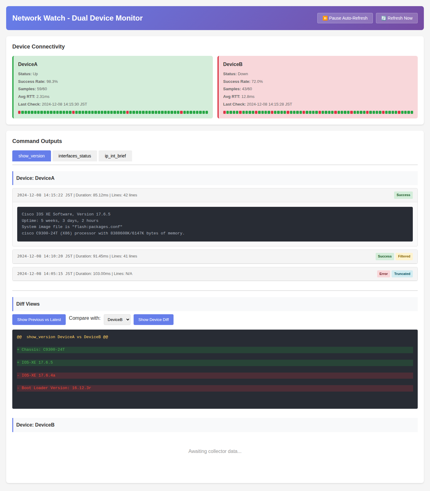

# Web UI スクリーンショットガイド

Web UI の主要な機能をスクリーンショットで示します。表示内容はダミーデータを用いた例です。

## 画面の見どころ

- **ヘッダーと更新制御**: 「⏸ Pause Auto-Refresh」で自動更新の一時停止/再開、「🔄 Refresh Now」で手動更新ができます。
- **Device Connectivity（左上）**: デバイスごとの到達性を色付きタイルで表示。成功率、サンプル数、平均RTT、最後のチェック時刻に加えて、60秒分のタイムラインで連続した成功/失敗/不明を確認できます。
- **Command Outputs（中央〜下部）**: コマンドごとにタブ表示し、各デバイスの実行履歴を時系列で展開。成功/エラー、フィルタ済み、トランケートのバッジが付き、クリックで出力やエラー詳細を開閉できます。
- **Diff Views（下部）**: 「Show Previous vs Latest」で直近2回の差分、「Show Device Diff」で他デバイスとの比較差分を確認できます。追加行（緑）・削除行（赤）・ハンク情報（黄）を色分け表示します。

## 参考

- 日本語 README: [`README.ja.md`](../README.ja.md)
- 詳細なセットアップ手順や構成は英語版 README を参照してください。
